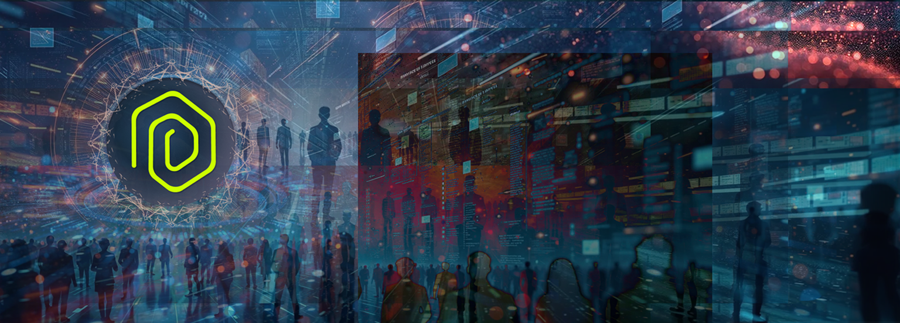

# Gybernaty DSP - Decentralized Social Platform

Decentralized Social Platform of the Gybernaty community - a project to unite researchers and enthusiasts interested in Web3 technologies, blockchain, distributed computing, and artificial intelligence.



## 🚀 Project Features

- **Full Mobile Adaptation**: Responsive design for all devices with unified breakpoint system
- **Animated Icons**: Dynamic flying cryptocurrency and technology icons
- **Modern Architecture**: Feature-Sliced Design (FSD) for scalability
- **Performance**: Optimized animations considering mobile devices
- **Docker Ready**: Full containerization support
- **TypeScript**: Strict typing for code reliability
- **Decentralization**: Built on decentralized system principles
- **Open Source**: Open source code for collaborative development

## 🛠 Technology Stack

- **Frontend**: Next.js 15.3.2, React 18.2.0, TypeScript 5.1.6
- **Animations**: Framer Motion 10.16.1
- **Styling**: SCSS/Sass with responsive breakpoints
- **Architecture**: Feature-Sliced Design (FSD)
- **Containerization**: Docker with multi-stage build
- **Responsive**: Responsive design with react-responsive
- **CI/CD**: GitHub Actions
- **Deploy**: Docker-ready production build

## 📱 Mobile Adaptation

The project is fully adapted for mobile devices:

- **Unified Breakpoint System**:
  - `xs`: 480px and above (mobile)
  - `sm`: 576px and above 
  - `md`: 768px and above (tablets)
  - `lg`: 960px and above
  - `xl`: 1280px and above (desktop)

- **Optimized Animations**:
  - Maximum 3 icons on mobile devices
  - Maximum 5 icons on desktop
  - Adaptive sizes and intervals

- **Fixed hydration mismatch** in useMediaQuery hook
- **Responsive containers** with proper padding

## 🎨 Animated Icons

21 high-quality SVG icons:

**Cryptocurrencies (13)**: Bitcoin, Ethereum, Cardano, Solana, Polygon, Polkadot, Litecoin, BNB, NEAR, Ethereum Classic, Toncoin, Tron, Internet Computer

**Technologies (8)**: React, Node.js, Next.js, Python, Flutter, Rust, Go, **Kubernetes (new)**

- Smooth animations with Framer Motion
- Adaptive performance management
- Automatic generation every 3 seconds
- Full mobile device support

## 📦 Quick Start

### Local Development

```bash
# Clone repository
git clone https://github.com/TheMacroeconomicDao/DSP.git
cd DSP

# Install dependencies
npm install
# or
yarn install

# Run in development mode
npm run dev
# or
yarn dev
```

Open [http://localhost:3000](http://localhost:3000) in your browser.

### Docker (recommended for production)

```bash
# Build and run with docker-compose
docker-compose up --build

# Or separate Docker commands
docker build -t gybernaty-dsp .
docker run -p 3000:3000 gybernaty-dsp
```

The application will be available at [http://localhost:3000](http://localhost:3000).

## 📝 Documentation

Detailed project documentation is available in the [docs](./docs/) directory:

- [Architecture Overview](./docs/architecture/README.md)
- [Components](./docs/components/README.md)
- [Development Guide](./docs/development/README.md)
- [API Documentation](./docs/api/README.md)
- [Deployment Guide](./docs/deployment/README.md)
- [Contribution Guide](./docs/contribution/README.md)

## 🏗 Project Architecture (FSD)

```
src/
├── app/                 # Application pages (Next.js App Router)
│   ├── aic/            # AIC page
│   ├── events/         # Events
│   ├── experiment/     # Experiments
│   ├── offering/       # Offerings
│   └── platform/       # Platform
├── entities/           # Business entities
│   ├── CardMember/     # Member card
│   ├── EventCard/      # Event card
│   ├── Roadmap/        # Roadmap
│   └── ...
├── features/           # Application features
│   └── AnimatedBackground/ # Animated background
├── shared/             # Shared components
│   ├── constants/      # Constants (breakpoints, configuration)
│   ├── hooks/          # Reusable hooks
│   ├── ui/             # UI components
│   └── ...
└── widgets/            # Composite widgets
    ├── Header/         # Header
    ├── Footer/         # Footer
    ├── Navbar/         # Navigation
    └── ...
```

## 🔧 Technical Improvements

### Recent Fixes:
- ✅ **Fixed hydration mismatch** in useMediaQuery hook
- ✅ **Solved animation problem** - icons now fly correctly
- ✅ **TypeScript errors resolved** - export of AnimatedIconsBackgroundProps interfaces
- ✅ **Docker optimization** - multi-stage build with Node 18 Alpine
- ✅ **Webpack caching** - disabled problematic options for stability
- ✅ **Unified breakpoint system** - consistent responsive design
- ✅ **Added Kubernetes icon** - expanded collection to 21 icons

### Performance Configuration:
- Optimized animations for mobile devices
- Lazy loading components
- Static resource compression
- Caching in production build

## 🌐 About Gybernaty Project

Gybernaty is a progressive community of researchers and developers. We conduct research in relevant areas of technology and develop innovative prototypes and products in the fields of web3, blockchain, distributed systems, and artificial intelligence.

Our mission is to realize a large-scale open source ecosystem that is a powerful and user-friendly environment promoting open education, effective experience sharing, and organization of progressive research and development of innovative prototypes and products within GyberExperiment.

## 💪 Contributing to the Project

We welcome community contributions to the project development. Please refer to the [contribution guide](./docs/contribution/README.md).

Main steps:
1. Fork the repository
2. Create a branch for your feature/fix
3. Follow project code standards
4. Create a Pull Request

## 📄 License

This project is distributed under an open license. See the [LICENSE](LICENSE) file for additional information.

## 📞 Contacts

- **Telegram**: [HeadsHub](https://t.me/HeadsHub)
- **GitHub**: [TheMacroeconomicDao](https://github.com/TheMacroeconomicDao)
- **GitHub**: [GyberExperiment](https://github.com/GyberExperiment)

